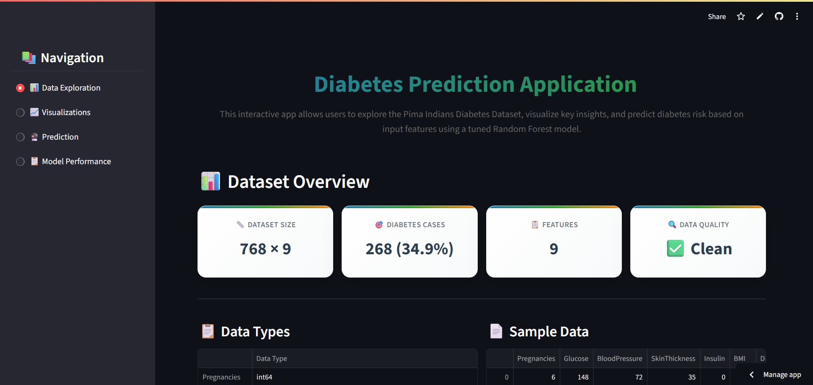
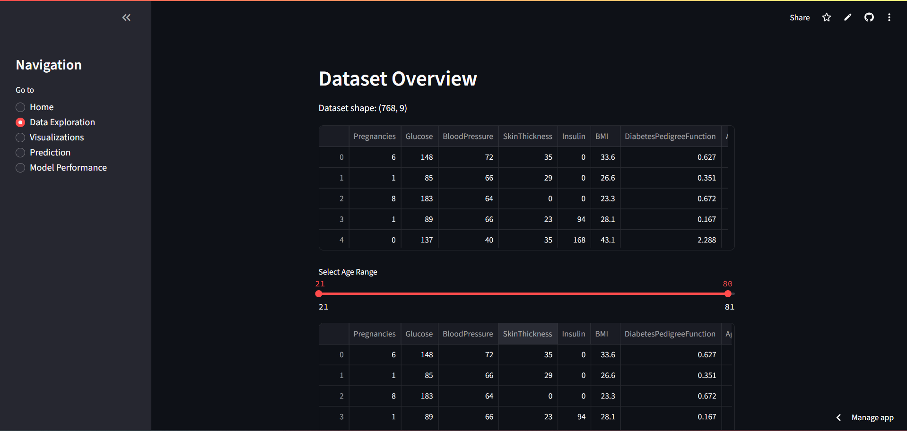
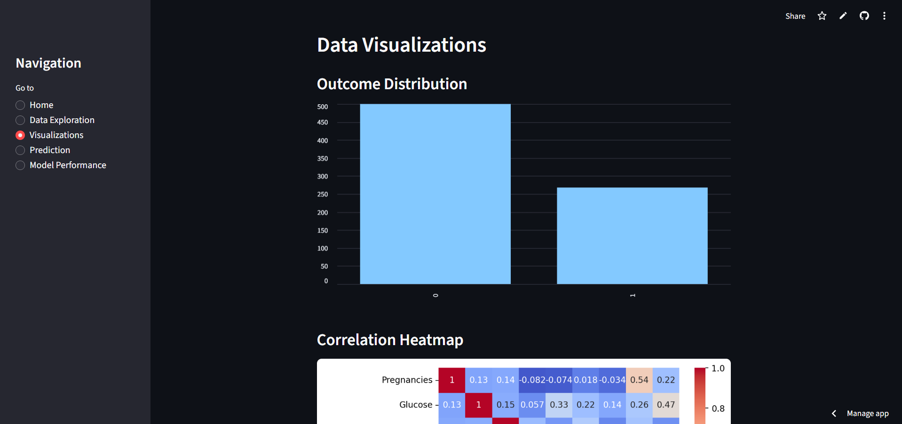
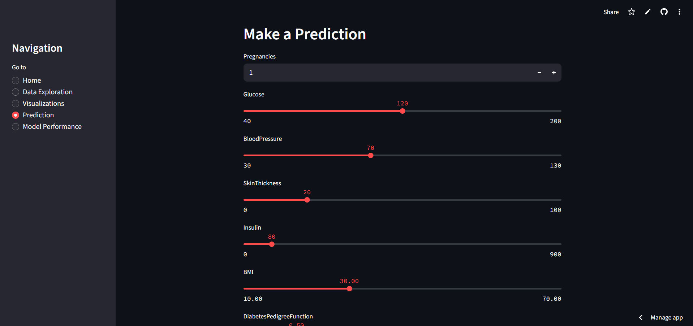
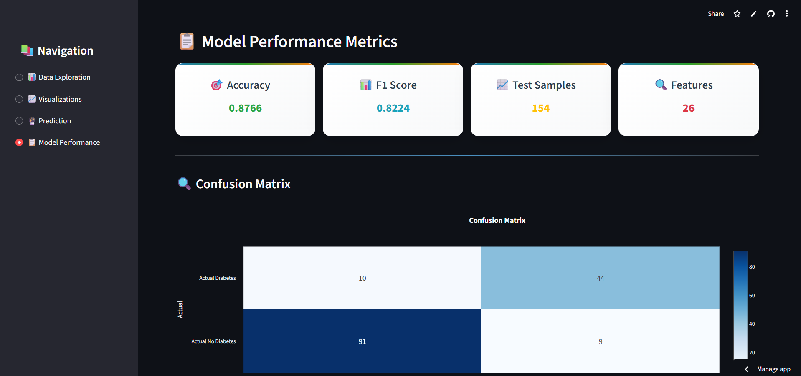

# 🧠 Diabetes Prediction Web App

A Machine Learning powered web application built using **Streamlit** that predicts whether a person is likely to have diabetes based on medical attributes.

## 📌 Table of Contents

- [Project Overview](#project-overview)
- [Features](#features)
- [Technologies Used](#technologies-used)
- [Project Structure](#project-structure)
- [How to Run](#how-to-run)
- [Model Training Notebook](#model-training-notebook)
- [Input Features](#input-features)
- [Screenshots](#screenshots)
- [License](#license)

---

## 📖 Project Overview

This project uses a dataset of patients with features like glucose level, BMI, age, etc., to predict diabetes using supervised machine learning. It enables real-time user interaction through a clean and intuitive **Streamlit interface**.

The goal is to make diabetes prediction accessible and interactive for educational or early diagnostic purposes.

---

## ✨ Features

✅ **Interactive Data Exploration:** Explore the dataset with filters and view summary statistics.  
✅ **Rich Visualizations:** Outcome distribution, correlation heatmaps, and feature histograms.  
✅ **Live Prediction:** Input patient data into a simple form and get an instant diabetes prediction with a probability score.  
✅ **Model Performance Insights:** View key metrics like Accuracy, Precision, Recall, F1-Score, and ROC AUC, along with a confusion matrix.  
✅ **User-Friendly Web UI:** A clean and multi-page interface built with Streamlit.

---

## 🛠️ Technologies Used

- **Python 3.x**
- **Streamlit:** For the web application interface.
- **scikit-learn:** For machine learning models and metrics.
- **Pandas:** For data manipulation and analysis.
- **Matplotlib & Seaborn:** For data visualization.
- **Joblib:** For saving and loading the trained model.

---

## 🗂️ Project Structure

```
diabetes-prediction/
├── app.py                         # Main Streamlit application
├── best_model_random_forest.pkl   # Trained and saved ML model
├── requirements.txt               # Project dependencies
├── data/
│   └── diabetes.csv               # The dataset used for training
├── notebooks/
│   └── model_training.ipynb       # vs code for EDA and model training
└── README.md                      # You're reading this!
```

---

## 🚀 How to Run

### 1. Clone the Repository

```bash
git clone https://github.com/sanjula77/diabetes-prediction.git
cd diabetes-prediction
```

### 2. Create and Activate a Virtual Environment (Recommended)

```bash
# For Windows
python -m venv venv
venv\Scripts\activate

# For macOS/Linux
python3 -m venv venv
source venv/bin/activate
```

### 3. Install Dependencies

```bash
pip install -r requirements.txt
```

### 4. Run the Streamlit App

```bash
streamlit run app.py
```

The app will open in your browser, typically at `http://localhost:8501`.

---

## 🧪 Model Training Notebook

The notebook `notebooks/model_training.ipynb` provides a detailed walkthrough of:

- **Exploratory Data Analysis (EDA):** Understanding the data distributions and correlations.
- **Data Preprocessing:** Cleaning the data by handling invalid zero values and scaling features using `StandardScaler`.
- **Model Selection:** Training and evaluating both `LogisticRegression` and `RandomForestClassifier`.
- **Performance Evaluation:** Comparing the models based on Accuracy, Precision, Recall, F1-Score, and ROC AUC. The Random Forest model was chosen as the best performer.
- **Saving the Best Model:** The trained `RandomForestClassifier` is saved to `best_model_random_forest.pkl`.

---

## 🧾 Input Features for Prediction

- **Pregnancies:** Number of times pregnant
- **Glucose:** Plasma glucose concentration over 2 hours in an oral glucose tolerance test
- **BloodPressure:** Diastolic blood pressure (mm Hg)
- **SkinThickness:** Triceps skin fold thickness (mm)
- **Insulin:** 2-Hour serum insulin (mu U/ml)
- **BMI:** Body mass index (weight in kg / (height in m)^2)
- **DiabetesPedigreeFunction:** A function that scores the likelihood of diabetes based on family history
- **Age:** Age in years

---

## 📸 Screenshots

### Home Page


### Data Exploration


### Visualizations


### Prediction


### Model Performance


---

## 📃 License

This project is licensed under the MIT License. Feel free to use, modify, and share.
